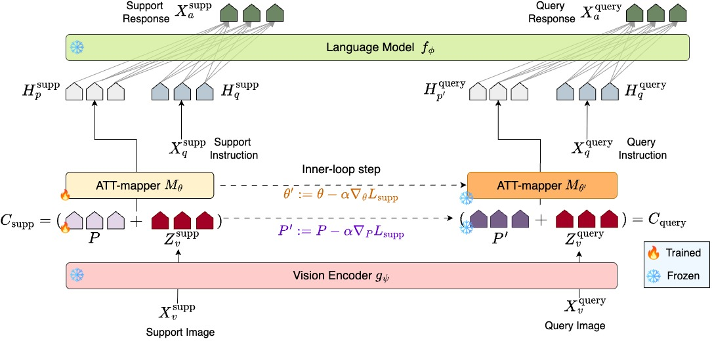

<h1 align="center">Meta-Adaptive Prompt Distillation for Few-Shot Visual Question Answering</h1>
<p align="center">
  <a href="https://www.linkedin.com/in/akashgupta97">Akash Gupta</a>,
  <a href="https://homepages.inf.ed.ac.uk/amos">Amos Storkey</a>,
  <a href="https://homepages.inf.ed.ac.uk/mlap">Mirella Lapata</a>
</p>
<!--<hr style="border:0; height:1px; background-color:#ccc;" /> -->

## Abstract



Large Multimodal Models (LMMs) often rely on in-context learning (ICL) to perform new tasks with minimal supervision. However, ICL performance, especially in smaller LMMs, is inconsistent and does not always improve monotonically with increasing examples. We hypothesize that this occurs due to the LMM being overwhelmed by additional information present in the image embeddings, which is not required for the downstream task. To address this, we propose a meta-learning approach that provides an alternative for inducing few-shot capabilities in LMMs, using a fixed set of soft prompts that are distilled from task-relevant image features and can be adapted at test time using a few examples. To facilitate this distillation, we introduce an attention-mapper module that can be easily integrated with the popular LLaVA v1.5 architecture and is jointly learned with soft prompts, enabling task adaptation in LMMs under low-data regimes with just a few gradient steps. Evaluation on the VL-ICL Bench shows that our method consistently outperforms ICL and related prompt-tuning approaches, even under image perturbations, improving task induction and reasoning across visual question answering tasks. Please visit our 📃 paper on arxiv - [Link](dummy_link). This code is based on the LLaVA repository - [Link](https://github.com/haotian-liu/LLaVA/tree/main) and below we list out steps for running training and evaluation for MAPD and other prompt distillation approaches.

## Install dependencies

```Shell
conda create -n MAPD python=3.10 -y
conda activate MAPD
pip install -e .
pip install -e ".[train]"
pip install accelerate==0.21.0
pip install peft==0.13.2
pip install flash-attn==2.6.3 --no-build-isolation
```

## Data Preparation

The current implementation of MAPD uses the LLaVA pretraining and finetuning datasets. We refer to the publicly available release of these datasets on HuggingFace.

### Pretraining

We use the LCS-558K subset (also used in LLaVA v1.5 pretraining) of the LAION/CC/SBU dataset filtered with a more balanced concept coverage. [Link](https://huggingface.co/datasets/liuhaotian/LLaVA-Pretrain)

The final datasets directory should be structured in the following way:

```
datasets/
|-- LLaVA-Pretrain
|   `-- Image_data
|       |-- blip
```


### Finetuning

For finetuning, we use the LLaVA v1.5 finetuning data mixture, which can be downloaded from here - [Link](https://huggingface.co/datasets/liuhaotian/LLaVA-Instruct-150K)

We remove the ShareGPT-40K dataset from the llava_v1_5_mix665k.json as we do not use unimodal text-only data. We further include 3 datasets in our finetuning from the LLaVA-OneVision data mixture designed to solve mathematical question answering tasks - MAVIS_math_metagen, TabMWP_Cauldron, geo170k(qa). These can be downloaded from here. [Link](https://huggingface.co/datasets/lmms-lab/LLaVA-OneVision-Data)
(NOTE: geo170k is further divided (basic, reasoning) based on the task instructions.)

The final datasets directory should be structured in the following way:

```
datasets/
|-- LLaVA-Instruct
|   |-- Image_data
|   |   |-- aokvqa
|   |   |-- basic_qa_geo170k
|   |   |-- coco
|   |   |-- complex_res
|   |   |-- conv
|   |   |-- det
|   |   |-- gqa
|   |   |-- mavis_math_metagen
|   |   |-- ocr_vqa
|   |   |-- okvqa
|   |   |-- reasoning_qa_geo170k
|   |   |-- refcoco
|   |   |-- sharegpt
|   |   |-- tabmwp_cauldron
|   |   |-- textvqa
|   |   |-- vg
|   |   `-- vqav2
```

Each dataset has its own JSON conversations file which is needed for meta-task creation and we perform the split in the following way - MAPD and all other prompt distillation approaches require separating all the datasets so as to create meta-tasks for training. In the LLaVA v1.5 mixture, we simply separate all the datasets by either searching for the available dataset keyword names or based on the task instructions as provided in Table 8 in the paper - *Improved baselines with Visual Instruction Tuning* ([Link](https://arxiv.org/pdf/2310.03744)) for the conversation data downloaded from the above link (llava_v1_5_mix665k.json). The images should be placed in their respective folders inside each dataset directory based on the image paths.


## Model Training

### Models Used

We use the same vision encoder as LLaVA i.e.  CLIP ViT-L/14-336px ([Link](https://huggingface.co/openai/clip-vit-large-patch14-336)), an attention-mapper module (implemented in the AttentionMapper class in ```https://github.com/akashgupta97/MAPD/blob/main/llava/model/multimodal_projector/builder.py```), and Qwen2.5-7B-Instruct ([Link](https://huggingface.co/Qwen/Qwen2.5-7B-Instruct)) as our base LLM. The pretrained weights for CLIP and Qwen LLM are automatically downloaded using HuggingFace when executing the below scripts.

### Compute Requirements

The current model training pipeline uses 4 H200 GPUs with a 143GB VRAM per GPU for all the prompt distillation approaches as mentioned in Appendix A.1.3 of our paper. 

### Pretraining

Please run the below command to start model pretraining

```Shell
bash scripts/v1_5/pretrain_qwen_sl.sh
```

### Finetuning

Please run the below command to start model finetuning

**MAPD**

```Shell
bash scripts/v1_5/finetune_qwen_mapd.sh
```

**Multi-Task<sup>PD</sup>**

```Shell
bash scripts/v1_5/finetune_qwen_mltasks.sh
```

**NoMetaTask<sup>PD</sup>**

```Shell
bash scripts/v1_5/finetune_qwen_sl.sh
```

**In-Context<sup>PD</sup>**

```Shell
bash scripts/v1_5/finetune_qwen_ict.sh
```

**ModelAvg<sup>PD</sup>**

This uses the same script as NoMetaTask<sup>PD</sup> but we finetune the attention-mapper separately on each dataset in our finetuning data mixture and then compute a weighted average of parameters.

The MAML code is borrowed from the implementation of Antoniou et al. - *How to Train Your MAML* ([Link](https://github.com/AntreasAntoniou/HowToTrainYourMAMLPytorch/tree/master)) and our modified version can be found in the ```MetaTrainer``` and ```MetaTuning``` classes in file ```llava/train/few_shot_learning_system.py``` [Link](https://github.com/akashgupta97/MAPD/blob/main/llava/train/few_shot_learning_system.py).

## Model Evaluation

Our model evaluation involves both in-context learning (ICL) and finetuning-based (FT) adaptation. We provide our evaluation script in ```MAPD/llava/eval/run_eval_meta.py```.

To run evaluation, please run the following bash file that runs the evaluation script
```Shell
bash llava/eval/run_eval_meta.sh
```

In this bash script, For FT set ```--finetuning True```, ICL ```--in-context True```

We use the VL-ICL benchmark for our few-shot evaluation - *VL-ICL BENCH: THE DEVIL IN THE DETAILS OF MULTIMODAL IN-CONTEXT LEARNING* ([Link](https://arxiv.org/pdf/2403.13164)).


## Citation


